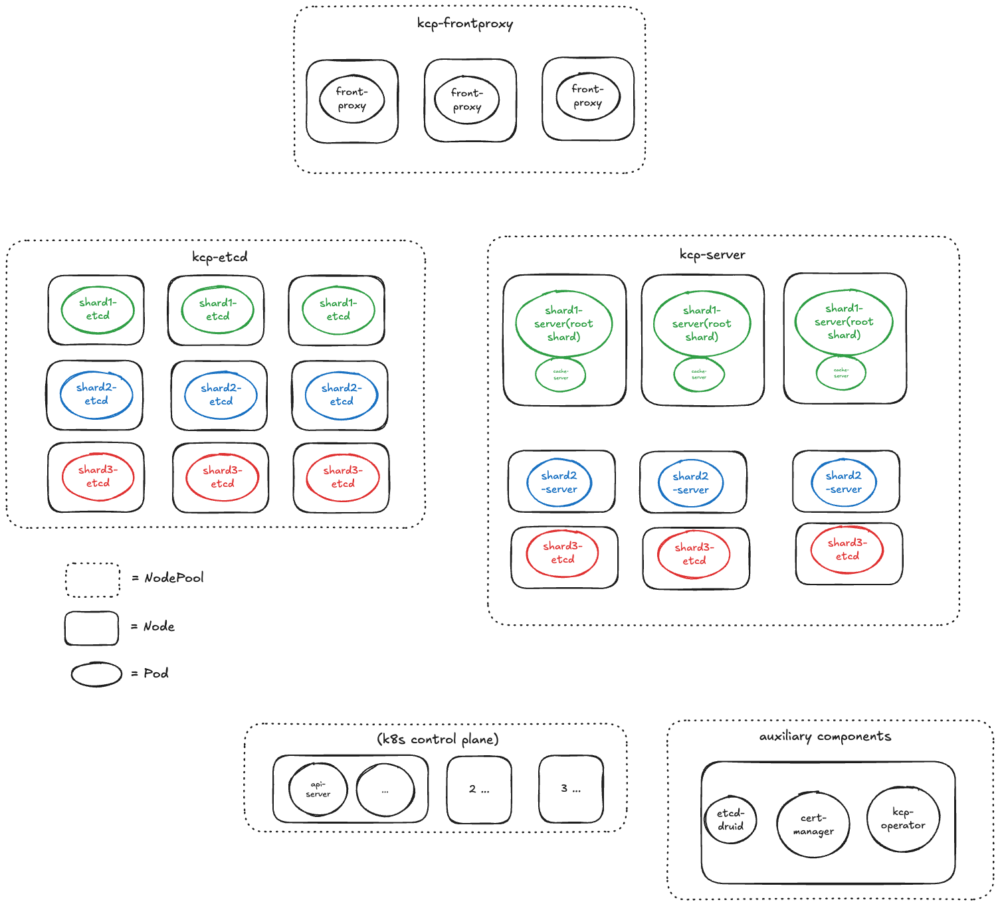
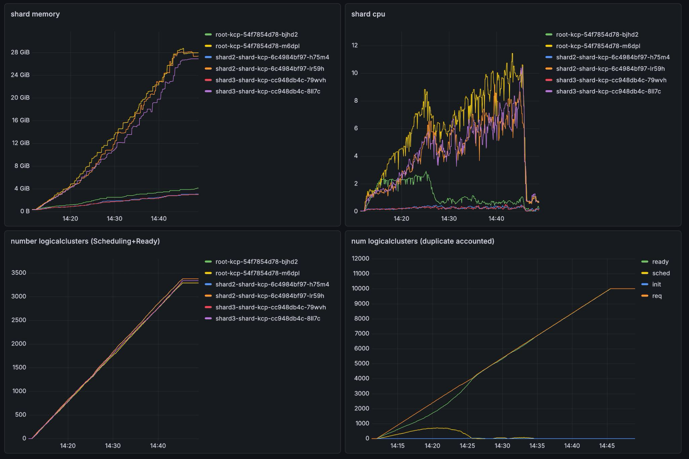
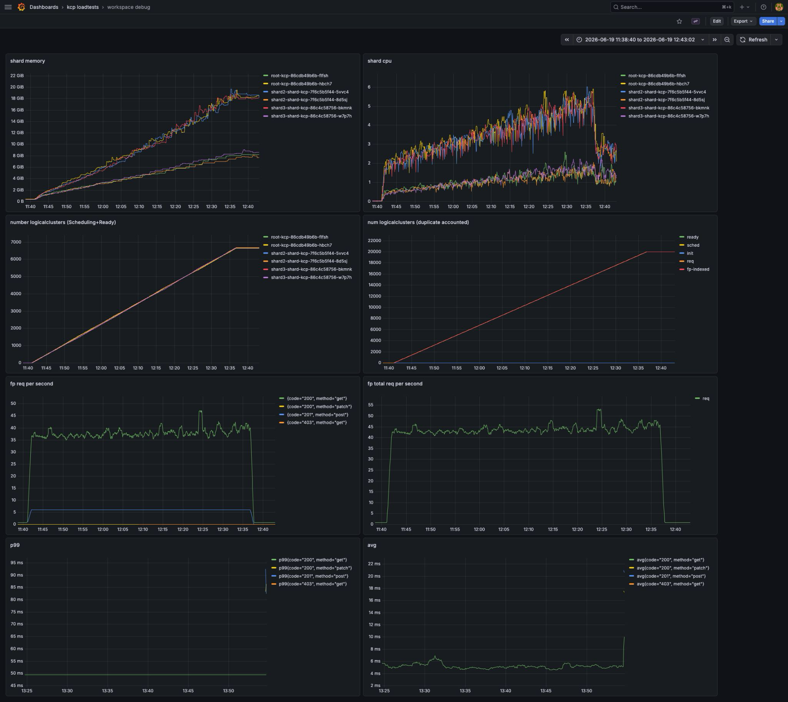
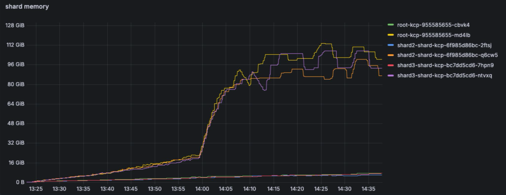
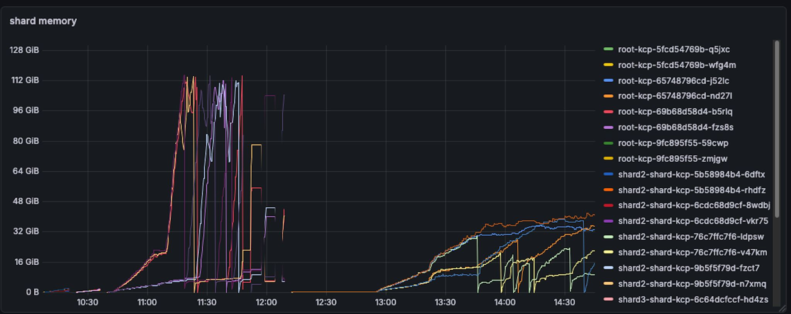

# Loadtest Report Sep 2026 - "Scaling kcp to 10000 Tenants"

This document is the follow-up to our [April 2026 report](loadtest-report-apr-2026.md) and summarizes the performance work that went into kcp between the two reports. It spans the work of 8 kcp community members across 36 PRs over more than 6 months.

**tl;dr: If you want all of the improvements described below, upgrade to kcp v0.32.2+.**

Results in this report are grouped by area, not chronologically by release to provide a better reading experience.

## Test Setup and Methodology

### Testing Philosophy

We wanted to:

* Reflect a real-world scenario of 10000 tenants
* Not find theoretical limits
* See how the system feels for end-users

This led us to virtual-user based testing: the following steps are run in parallel for multiple (virtual) users:

1. Create workspace & wait for it to become ready
2. Create APIExport for providers
3. Create APIBinding for consumers
4. CRUD on CustomResources

Each step has an individual queries-per-second (QPS) setting and all tuningsets are uniform, so no bursts. Unless stated otherwise, tests ran with the following parameters:

```go
WorkspaceCount:       10000,
WorkspaceDepth:       5,
WorkspaceTreeType:    "symmetric",
CreateWorkspaceQPS:   8.0,
CRUDConfigMapQPS:     150,
CreateAPIExportQPS:   4.0,
CreateAPIBindingQPS:  4.0,
CRUDSharedAPIQPS:     150,
CRLeafFields:         160,
CRListItems:          30,
CRTargetSizeBytes:    6000,
```

### Architecture

* We use [kcp-operator](https://github.com/kcp-dev/kcp-operator) and [etcd-druid](https://github.com/gardener/etcd-druid) to manage components
* We run 3 shards with two replicas each; replicas are in active-passive fail-over mode
* Each shard has its own dedicated etcd cluster with 3 members
* => Each shard hosts ~3333 workspaces



### Client Settings

To make sure we measure kcp and not our own client stack, the load-generating clients use:

* A non-interactive ClientConfig
* Fully-disabled client-side rate limiting
* A disabled WarningHandler
* Increased `MaxIdleConns` & `MaxIdleConnsPerHost`, but an unchanged `IdleConnTimeout` to mimic real-world clients

## Result 1 - Workspace Creation Memory

On kcp v0.30.3, an empty workspace took **~9.8 MiB** of memory during high load and **~7.4 MiB** after Go GC compaction - which is a lot. This matches the sizing recommendation from the April report.



### One of Our Biggest Culprits Was k8s Garbage Collection

After inspecting a kcp pprof dump under load, ~12% of memory consumption during peak load came from the Kubernetes garbage collector group, and each workspace created ~7 goroutines solely for GC.

Garbage collection for Kubernetes objects is a resource-intensive task:

* A directed acyclic graph is built of all objects based on their ownerReferences
* A monitor is created for every single existing type and then re-synced whenever a new type is added
* Affected objects are managed via two workqueues: `attemptToDelete` and `attemptToOrphan`

kcp used to run this whole stack once *per logicalcluster* - so 10000 times for our test.

The fix was to make the garbage collector cluster-aware: a single GC instance now builds one dependency graph whose nodes are additionally keyed by logical cluster, served by one shared worker pool ([kubernetes#192](https://github.com/kcp-dev/kubernetes/pull/192) in our Kubernetes fork, wired up in [kcp#4044](https://github.com/kcp-dev/kcp/pull/4044)). This removed the per-workspace goroutines, workqueues, graphs and repeated discovery syncs.

With cluster-aware GC (v0.32.0+), memory consumption drops from ~9.8 MiB to **~3.1 MiB** per empty workspace, and overall CPU spikes are ~50% lower:



## Result 2 - High Memory Consumption on APIExport and APIBinding Creation

On kcp v0.31.0, creating 500 APIExports and 9500 APIBindings on top of the 10000 workspaces produced a memory footprint of **~210 GiB** across shards. In further analysis in [kcp#4168](https://github.com/kcp-dev/kcp/issues/4168), we found the cost of an APIBinding to  measure ~66 goroutines and ~0.85 MiB of steady-state cost.


### Fixing APIBindings & Exports - ResourceQuotas

The largest single contributor was the ResourceQuota controller:

* The ResourceQuota controller needs to watch every (quotable) GVR, regardless of whether an actual quota is set
* kcp ran one quota controller per workspace, resulting in `n workspaces × m GVRs` handler registrations and goroutines - and every APIBinding adds GVRs to its workspace
* Now a single cluster-aware quota controller per shard uses the central DiscoveringDynamicSharedInformerFactory, which directly produces informers for a specific GVR across all logical clusters ([kubernetes#196](https://github.com/kcp-dev/kubernetes/pull/196), [kcp#4183](https://github.com/kcp-dev/kcp/pull/4183))

Several further fixes contributed to the improvement:

* MutatingAdmissionPolicy machinery (informers, cache replication, admission delegates) is now gated behind its feature gate instead of always running ([kcp#4202](https://github.com/kcp-dev/kcp/pull/4202))
* VAP/MAP admission now shares one REST mapper and one TypeConverter per target cluster instead of per-workspace discovery caches and 5s OpenAPI-polling goroutines ([kcp#4217](https://github.com/kcp-dev/kcp/pull/4217))
* The OpenAPI endpoint for the `system:bound-crds` logical cluster - which would build and merge specs for *every* bound CRD on the shard - is disabled ([kcp#4333](https://github.com/kcp-dev/kcp/pull/4333))

With these fixes (v0.32.2+), the same test that peaked at ~112 GiB per root shard replica on v0.31.0 stays below ~48 GiB:



For end-users, APIBinding creation is fast at this scale. A run with 40 provider workspaces and 19960 consumer workspaces (one binding each) at 4 QPS shows sub-second readiness:

```text
Metric                          Value
------                          -----
avg_binding_create_duration_ms  41.9
avg_binding_ready_duration_ms   520.3
p99_binding_create_duration_ms  56.4
p99_binding_ready_duration_ms   552.0
p99_duration_ms                 599.7
```

## Additional Improvements

### Workspace Deletion No Longer Stalls for 5-10 Minutes per Hierarchy Level

In the April report we observed that deleting a symmetric tree of 10000 workspaces took roughly an hour, with long stalls ([kcp#4072](https://github.com/kcp-dev/kcp/issues/4072)). The cause: workspace deletion was purely poll-based, with an age-based requeue that could wait up to 10 minutes before noticing that a workspace's LogicalCluster was gone - and in a tree this delay compounds per hierarchy level, since a parent can only be cleaned up after all children.

Since v0.32.0, deletion is event-driven ([kcp#4047](https://github.com/kcp-dev/kcp/pull/4047)): the workspace controller registers event handlers on both the shard-local and the cache (replicated) LogicalCluster informers and maps deletion events back to the owning Workspace via a new `byLogicalCluster` index, with the adaptive requeue cap halved to 5 minutes as a fallback. A workspace whose LogicalCluster disappears is now reconciled immediately, including in cross-shard setups.

### Metrics Cardinality Reduced by ~140000 Series at 10000 Workspaces

Also reported in April ([kcp#4007](https://github.com/kcp-dev/kcp/issues/4007)): metrics grew steadily with the number of logical clusters, from ~25000 series on an empty kcp to over 160000 with ~3000 workspaces. This was driven by per-workspace controller instances registering per-workspace workqueue metrics - most notably the quota controller, whose workqueues were named `quota-<cluster>` and thus produced a fresh label set per workspace ([kcp#4050](https://github.com/kcp-dev/kcp/pull/4050)).

The structural fix came from clusterizing the garbage collector ([kcp#4044](https://github.com/kcp-dev/kcp/pull/4044)) and the quota controller ([kcp#4183](https://github.com/kcp-dev/kcp/pull/4183)) - one controller per shard means one set of workqueue metrics per shard. Together with the workqueue rename this reduces cardinality by ~140000 series for 10000 workspaces (v0.32.1+). As a bonus, the "ghost LogicalCluster" from April - system logical clusters permanently reporting the `Scheduling` phase ([kcp#4010](https://github.com/kcp-dev/kcp/issues/4010)) - was fixed by completing the phase state machine ([kcp#4048](https://github.com/kcp-dev/kcp/pull/4048)), making the phase gauges trustworthy.

### Cold Startup Time Decreased by ~30 Seconds

Shard startup used to bootstrap its built-in resources strictly sequentially: file-by-file manifest creation, one root APIBinding at a time (each with 1-second poll loops on conflicts), and one identity secret after another. A series of PRs ([kcp#3847](https://github.com/kcp-dev/kcp/pull/3847), [kcp#3888](https://github.com/kcp-dev/kcp/pull/3888), [kcp#3889](https://github.com/kcp-dev/kcp/pull/3889), [kcp#3890](https://github.com/kcp-dev/kcp/pull/3890), [kcp#3891](https://github.com/kcp-dev/kcp/pull/3891)) parallelized all of this with errgroups: manifests are parsed once, grouped into dependency tiers (CRDs → core.kcp.io → WorkspaceType → APIResourceSchema → APIExport → APIBinding → Namespace), and all objects within a tier are created concurrently. Root API bindings and identity secrets are likewise created in parallel, so total time approaches that of the slowest single object instead of the sum. This shaved roughly 30 seconds off a ~30-60 second cold start (v0.31.0+) - which matters for fail-over, since our replicas run in active-passive mode.

## Looking Ahead

For the test itself, we are planning the following two improvements next.

1. Fully automated load testing before releases, with comparison against previous results
2. Adding external controllers and hooks into the mix

We are very interested in testing your use-cases. Please fill out the the [kcp user survey for 2026](https://forms.gle/rfe26dCCDDrAKDrC8). This gives us as a team an opportunity to understand real-world kcp setups better and tailor load-testing towards them.
